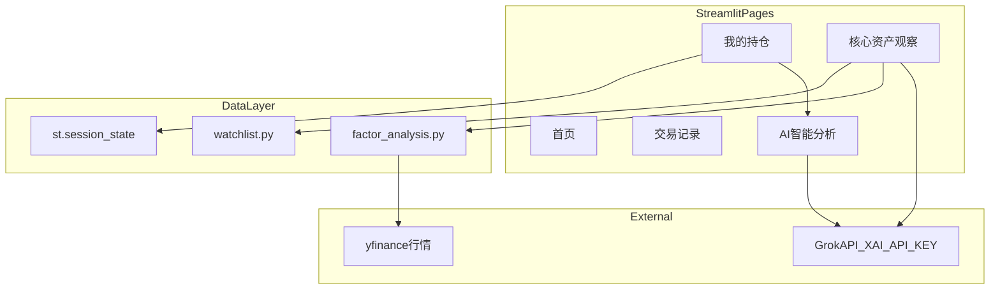
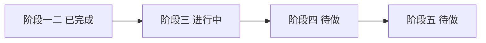

# Personal Asset Manager — 项目状态文档（上下文锚点）

> **最后更新**：2026-06-05  
> **最新提交**：`d173147`（本地待 push A0 改动）  
> **用途**：开新对话时复制全文（或附录模板），让 Agent 快速了解项目，减少重复沟通与 token 浪费。

---

## 1. 项目概述（Project Overview）

**一句话定位**：基于 Streamlit 的**自用**个人资产管理平台，支持持仓编辑、50 支核心资产观察、多因子量化评分与 Grok AI 趋势分析。

| 字段 | 内容 |
|------|------|
| 项目名称 | Personal Asset Manager（个人资产管理平台） |
| 本地路径 | `C:\Users\newne\personal-asset-manager` |
| GitHub | https://github.com/Alanc0414/personal-asset-manager |
| 线上地址 | https://personal-asset-manager-646ufqdwxdletfqpvtmum7.streamlit.app/ |
| 主入口 | `app.py` |
| 分支 | `main` |
| 部署 | GitHub push → Streamlit Cloud 自动部署 |
| 运行状态 | 已上线；Grok API 已验证可用 |
| 用户类型 | 编程小白；只提目标，由 Cursor 执行开发 |
| 分享说明 | 链接可外发；持仓数据按浏览器会话隔离；**AI 调用消耗所有者 xAI API 额度** |

### 开发阶段总览

| 阶段 | 内容 | 状态 |
|------|------|------|
| 阶段一 | 修复崩溃 + 持仓可编辑表格 | 已完成 |
| 阶段二 | 50 支核心资产列表展示 | 已完成 |
| 阶段三 | 多因子评分 + Grok 趋势分析 | **进行中** |
| 阶段四 | 持仓 vs 核心资产联动分析 | 待做 |
| 阶段五 | 持久化、CSV、界面美化、访问控制 | 待做 |

### 架构概览



---

## 2. 当前功能状态（Current Features Status）

### 功能总表

| 模块 | 状态 | 阶段 | 关键实现 | 备注 |
|------|------|------|----------|------|
| 首页 | 已完成 | — | 项目简介、导航引导 | — |
| 我的持仓 — 可编辑表格 | 已完成 | 一/二 | `st.data_editor` + `portfolio_df` | 仅数量/价格可编辑 |
| 我的持仓 — 自动算市值 | 已完成 | 一/二 | `recalculate_market_value()` | 数量 × 价格 |
| 我的持仓 — 添加/删除 | 已完成 | 一/二 | `st.form` + 多选删除 | 代码可留空，eth 自动识别 |
| 我的持仓 — 保存 | 已完成 | 一/二 | → `my_portfolio` | 供 AI 页读取 |
| 核心资产观察 — 列表 | 已完成 | 二/三 | `get_watchlist_df()` 50 只 | 20 美股 + 20 港股 + 10 币 |
| 核心资产观察 — 搜索筛选 | 已完成 | 二/三 | 关键词 + 类型/市场 | — |
| 核心资产观察 — 多选分析 | 已完成 | 三 | `multiselect`，最多 10 只 | 全选/清空按钮 |
| 核心资产观察 — 量化评分 | 部分完成 | 三 | `market_data.py` + `factor_analysis.py` | A0 已加固：重试/批量/缓存；**待线上验证** |
| 核心资产观察 — Grok 分析 | 已完成 | 三 | `call_grok_analysis` grok-3 | 需有效 XAI_API_KEY |
| AI 智能分析 — 持仓组合分析 | 已完成 | 一/三 | 读 `my_portfolio` 优先 | — |
| AI 智能分析 — 未来趋势预测 | 已完成 | 三 | Tab + 可选时间范围 | 基于持仓 |
| 交易记录 | 已完成 | — | 会话内 list | **无持久化** |
| 数据持久化 | 未开始 | 五 | — | 刷新恢复默认 |
| CSV 导入导出 | 未开始 | 五 | — | — |
| K 线可视化 | 未开始 | 三 | plotly 已依赖未接入 | — |
| 登录/访问控制 | 未开始 | 五 | — | 分享链接无密码 |

### 各模块要点（详见上表）

**我的持仓**
- `st.session_state["portfolio_df"]`；widget key=`portfolio_editor`
- USDT 统一显示「USDT」；防崩溃用 `coerce_to_dataframe`，禁用 `on_change`
- 实时展示：持仓数量、总市值

**核心资产观察**
- 流程：多选 → 量化评分表 → Grok Markdown 分析报告（含免责声明）

**AI 智能分析**
- 两个 Tab：持仓组合分析 / 未来趋势预测

---

## 3. 技术栈（Tech Stack）

| 类别 | 技术 | 版本/说明 | 用途 |
|------|------|-----------|------|
| 语言 | Python | 3.x | 运行时 |
| UI 框架 | Streamlit | >=1.35（线上 v1.58） | 全站 UI |
| 数据处理 | pandas | >=2.2 | DataFrame、session_state |
| 行情数据 | yfinance | >=0.2.40 | 多因子 K 线（1 年历史） |
| AI 调用 | openai SDK | >=1.30 | 兼容 Grok API |
| AI 模型 | grok-3 | xAI | 持仓/趋势/Watchlist 分析 |
| 可视化 | plotly | >=5.22 | 依赖已装，K 线待开发 |
| 工具库 | tenacity, requests, python-dotenv, loguru, schedule | 见 requirements.txt | 行情重试与 HTTP 会话 |
| 部署 | Streamlit Cloud | Community | 绑定 GitHub `main` |
| 密钥管理 | st.secrets / Secrets TOML | — | `XAI_API_KEY` |

---

## 4. 核心文件说明（Key Files）

```
personal-asset-manager/
├── app.py                 # 主应用（~760 行）
├── watchlist.py           # 50 资产列表（~75 行）
├── market_data.py         # 行情拉取（重试/超时/批量）
├── factor_analysis.py     # 多因子评分（~207 行）
├── verify_portfolio.py    # 离线验证脚本（~113 行）
├── requirements.txt       # 依赖
├── PROJECT_STATUS.md      # 本文件
├── .streamlit/
│   └── secrets.toml       # 本地密钥（gitignore）
└── .env.example           # 环境变量示例
```

| 文件 | 职责 | 关键符号/入口 |
|------|------|----------------|
| [`app.py`](app.py) | 5 个页面 UI、持仓逻辑、Grok 调用 | `recalculate_market_value`, `resolve_holding_input`, `call_grok_analysis`, `safe_init_portfolio_df` |
| [`watchlist.py`](watchlist.py) | 50 支资产 DataFrame | `get_watchlist_df()`, `WATCHLIST_50`, `WATCHLIST_COLUMNS` |
| [`market_data.py`](market_data.py) | 健壮行情拉取 | `fetch_symbol_history`, `fetch_histories_batch`, `classify_fetch_error` |
| [`factor_analysis.py`](factor_analysis.py) | 量化评分与 Grok 摘要 | `analyze_symbol_from_history`, `analyze_selected_assets`, `build_selected_assets_summary` |
| [`verify_portfolio.py`](verify_portfolio.py) | 本地逻辑自检 | `py verify_portfolio.py` |
| `.streamlit/secrets.toml` | 本地 API Key | `XAI_API_KEY = "xai-..."` |
| `PROJECT_STATUS.md` | 项目上下文锚点 | 本文件 |

### session_state 关键 Key

| Key | 类型 | 用途 |
|-----|------|------|
| `portfolio_df` | DataFrame | 持仓编辑态 |
| `my_portfolio` | DataFrame | 保存后供 AI 读取 |
| `portfolio_editor` | widget | data_editor 组件状态 |
| `watchlist_selected_labels` | list | 核心资产多选 |
| `transactions` | list | 交易记录（会话内） |

---

## 5. 最近变更记录（Recent Changes）

| 提交 | 日期（约） | 用户可感知的变化 |
|------|------------|------------------|
| （待 push） | 2026-06-05 | **A0**：行情拉取加固（重试/批量/缓存）；核心资产观察显示成功/失败汇总 |
| `d173147` | 2026-06-05 | 新增 PROJECT_STATUS.md 项目状态文档 |
| `c63dd84` | 2026-06-05 | API Key 更新后触发线上重新部署 |
| `ed35083` | 2026-06-05 | Secrets 更新后触发 redeploy |
| `a9b3b37` | 2026-06-05 | 添加 Dev Container 配置 |
| `7f626ba` | 2026-06-05 | **新增「核心资产观察」页**：50 只列表 + 多选 + 量化评分 + Grok 分析 |
| `4d04894` | 2026-06-05 | 持仓可编辑重构；新增 watchlist/factor_analysis 预备文件 |
| `3b1a052` | 2026-06-04 | 修复表格崩溃；USDT 改名；AI 页增加趋势预测 Tab |
| `d1aeb29` | 2026-06-04 | 持仓真正可编辑 + 市值自动计算 + AI 联动 |
| `3223c8b` | 更早 | 接入 st.secrets 读取 XAI_API_KEY |
| `36d7b09` | 更早 | 项目初始化 |

---

## 6. 下一步计划 / Roadmap（Next Priorities）



### 阶段三（进行中）— 多因子 + 趋势分析

- P0：修复 Streamlit Cloud 上 yfinance 行情拉取（重试、超时、友好报错）
- P1：50 只一键评分排行榜
- P1：分析结论更明确（值得关注 / 观望 / 谨慎）
- P2：K 线图表（plotly）

### 阶段四 — 联动分析

- P1：我的持仓 vs 50 只核心资产对比（重叠、缺失、评分对照）

### 阶段五 — 体验优化

- P2：持仓持久化（JSON/CSV/轻量 DB）
- P2：CSV 导入导出持仓
- P3：界面美化、`use_container_width` 弃用修复
- P3：可选密码登录（防 API 被刷）
- P3：GitHub README

---

## 7. 已知问题与待办事项（Known Issues & TODOs）

### 已知问题

| 问题 | 影响 | 优先级 | 临时应对 |
|------|------|--------|----------|
| 线上 yfinance 拉行情失败 | 量化评分表 None /「数据不足」 | P0 | A0 已加重试+批量+缓存；仍失败时看「失败详情」expander |
| 无数据持久化 | 刷新页面恢复默认持仓 | P2 | 分析前点「保存持仓数据」 |
| 交易记录不保存 | 刷新后清空 | P2 | — |
| 无登录控制 | 分享链接者可用 AI | P3 | 勿公开传播链接 |
| `use_container_width` 弃用警告 | 日志黄字 | P3 | 不影响运行 |
| 表格 `+` 号添加空行 | 出现 None 行 | — | 用下方表单添加，不用 `+` |

### TODO Checklist

**P0**
- [x] 修复线上 yfinance 行情拉取（A0：market_data.py + 重试/缓存，待线上验证）

**P1**
- [ ] 阶段四：持仓 vs Watchlist 联动对比
- [ ] 50 只一键评分排行
- [ ] 买入/观望结论更清晰

**P2**
- [ ] 持仓数据持久化
- [ ] CSV 导入导出
- [ ] AI 与真实持仓深度联动优化

**P3**
- [ ] 界面美化、移动端适配
- [ ] `use_container_width` → `width` 迁移
- [ ] 可选简单密码登录
- [ ] GitHub README

---

## 8. 本地运行与部署说明（How to Run & Deploy）

### 本地运行

```powershell
cd C:\Users\newne\personal-asset-manager
py -m pip install -r requirements.txt
```

创建 `.streamlit/secrets.toml`（勿提交 git）：

```toml
XAI_API_KEY = "xai-你的完整密钥"
```

启动：

```powershell
py -m streamlit run app.py
```

浏览器打开 `http://localhost:8501`。

离线验证持仓逻辑：

```powershell
py verify_portfolio.py
```

### 线上部署（Streamlit Cloud）

1. 代码 push 到 GitHub `main` 分支
2. Streamlit Cloud 自动拉取，日志出现 `Updated app!`
3. 浏览器 **Ctrl+F5** 硬刷新线上地址

**配置 API Key（线上，与 git 无关）**

1. 打开 https://share.streamlit.io → 登录
2. 进入应用 `personal-asset-manager` → **Secrets**
3. 写入 `XAI_API_KEY = "xai-..."` → **Save**
4. 等待约 1 分钟，或 push 触发 redeploy / Manage app → Reboot

**触发重新部署的方式**

- `git push origin main`（推荐）
- Streamlit Cloud → Reboot app
- 空提交 push（`chore: trigger redeploy`）

### 分享链接注意事项

- 访客看到的是**自己的空会话**，看不到你的持仓（除非你未来做账号系统）
- 访客使用 AI 功能会消耗**你的** xAI API 额度
- 建议只发给信任的人，或后续加密码

---

## 9. 开发规范与注意事项（Development Notes）

### 架构约定

- 主逻辑在 `app.py`；数据/算法拆到 `watchlist.py`、`factor_analysis.py`
- 导航页面固定 5 个：首页、我的持仓、核心资产观察、交易记录、AI 智能分析
- 新页面：改 `st.sidebar.radio` 的 `options` 并新增 `elif page ==` 分支

### st.data_editor 规范

- key=`portfolio_editor`；`num_rows="dynamic"`；`hide_index=True`
- **仅**「持有数量」「当前价格」可编辑
- 用 `edited_df` 返回值同步，**禁止** `on_change`（曾导致 AttributeError）
- 新增持仓用 `st.form`，不要用表格 `+` 号

### 持仓添加别名（resolve_holding_input）

| 用户输入 | 自动识别 |
|----------|----------|
| eth / 以太坊 | ETH-USD / 以太坊 |
| usdt / 泰达币 | USDT-USD / USDT |
| btc / 比特币 | BTC-USD / 比特币 |
| 代码留空 + 填名称 | 按类型自动生成代码 |

### Secrets 安全

- `XAI_API_KEY` 仅存于 `.streamlit/secrets.toml`（本地）和 Streamlit Cloud Secrets（线上）
- **绝不**提交到 git、**绝不**粘贴到聊天/截图
- 改 Key 后：Secrets Save → 等 1 分钟或 redeploy

### Grok API 调用

```python
client = OpenAI(api_key=..., base_url="https://api.x.ai/v1")
model = "grok-3"
```

### Cursor 协作约定

| 角色 | 职责 |
|------|------|
| 用户 | 只描述目标，不必写命令 |
| Cursor | 大头：改代码、测试、push、触发部署 |
| Grok 聊天 | 可选第二意见；结论用自然语言带回 Cursor |
| 避免 | Grok 生成命令 → 用户复制给 Cursor |

### 文档维护

- 每次完成重要功能后，更新本文件 **§2 功能总表**、**§5 Recent Changes**、**§7 TODO**
- 更新文首「最后更新」日期与「最新提交」hash

---

## 附录 A：新对话快速上下文模板

复制以下块到新对话开头（约 20 行）：

```
【项目上下文 — personal-asset-manager】

路径：C:\Users\newne\personal-asset-manager
线上：https://personal-asset-manager-646ufqdwxdletfqpvtmum7.streamlit.app/
仓库：https://github.com/Alanc0414/personal-asset-manager
最新提交：d173147
详细文档：PROJECT_STATUS.md（请先阅读）

技术栈：Streamlit + pandas + yfinance + Grok API (grok-3)
页面：首页 | 我的持仓 | 核心资产观察 | 交易记录 | AI智能分析

已完成：
- 持仓可编辑表（portfolio_df / my_portfolio）+ 保存
- 50 只核心资产观察 + 多选分析 + Grok 趋势分析
- AI 持仓分析 + 趋势预测 Tab

当前重点（P0/P1）：
- A0 已做：yfinance 重试/批量/缓存（待线上验证）
- 阶段四：持仓 vs Watchlist 联动
- 50 只一键评分排行

约束：
- XAI_API_KEY 在 Streamlit Secrets，不提交 git
- 用户是编程小白，只提目标
- data_editor 不用 on_change；Secrets 不随 git push

完整状态见 PROJECT_STATUS.md
```

---

## 附录 B：文档维护说明

- 本文件是项目**唯一权威上下文锚点**
- 与 plan 文件、聊天记录无关；以本文件 + 代码为准
- 重大变更后由 Cursor 或用户触发更新，并 optional push 到 GitHub

---

*Personal Asset Manager — PROJECT_STATUS.md*
