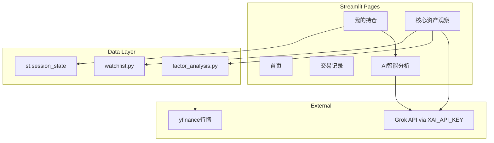

# Personal Asset Manager — 项目状态快照

> 最后更新：2026-06-05  
> 用途：开新对话时复制全文，让 Agent 快速了解项目现状。

---

## 1. 项目当前整体状态

| 字段 | 内容 |
|------|------|
| 项目名称 | Personal Asset Manager（个人资产管理平台） |
| 项目路径 | `C:\Users\newne\personal-asset-manager` |
| 技术栈 | Python 3.x + Streamlit + pandas + yfinance + OpenAI SDK（Grok API） |
| GitHub 仓库 | https://github.com/Alanc0414/personal-asset-manager |
| 线上地址 | https://personal-asset-manager-646ufqdwxdletfqpvtmum7.streamlit.app/ |
| 主入口文件 | `app.py` |
| 当前分支 | `main` |
| 最新提交 | `c63dd84` — chore: redeploy after xAI API key update |
| 部署方式 | GitHub `main` push → Streamlit Cloud 自动部署 |
| 运行状态 | 已上线；导航与核心功能可用；Grok API 已验证可用 |
| 用户定位 | 自用财经资产管理工具；链接可分享，但 AI 调用消耗所有者的 xAI API 额度 |

### 架构概览



### 文件结构

```
personal-asset-manager/
├── app.py                 # 主应用（所有页面 UI + Grok 调用）
├── watchlist.py           # 50 支核心资产列表 DataFrame
├── factor_analysis.py     # 多因子评分（yfinance + 量化指标）
├── verify_portfolio.py    # 本地离线验证脚本（持仓逻辑）
├── requirements.txt       # Python 依赖
├── .streamlit/
│   └── secrets.toml       # 本地密钥（gitignore，勿提交）
├── .env.example           # 环境变量示例
└── PROJECT_STATUS.md      # 本文件
```

---

## 2. 已完成功能列表

### 首页

- 项目简介与导航引导

### 我的持仓（阶段一、二已完成）

| 功能 | 说明 |
|------|------|
| 可编辑持仓表 | `st.data_editor`，key=`portfolio_editor` |
| 可编辑列 | 仅「持有数量」「当前价格」 |
| 自动算市值 | 市值 = 持有数量 × 当前价格 |
| 状态存储 | `st.session_state["portfolio_df"]` |
| 添加持仓 | `st.form` 表单；资产代码可留空（如 `eth` → ETH-USD） |
| 删除持仓 | 多选删除 + 表格勾选删行 |
| 保存 | 「保存持仓数据」→ `st.session_state["my_portfolio"]` |
| USDT 显示 | 统一为「USDT」，非「泰达币 (USDT)」 |
| 防崩溃 | `coerce_to_dataframe`；已移除 `on_change` 回调（曾致 AttributeError） |
| 实时指标 | 持仓数量、总市值（实时） |

### 核心资产观察（阶段三 3.1 + 部分 3.2/3.3）

| 功能 | 说明 |
|------|------|
| 50 支资产列表 | 20 美股 + 20 港股 + 10 加密货币（`watchlist.py`） |
| 搜索筛选 | 按代码/名称/备注搜索；类型、市场筛选 |
| 多选分析 | `multiselect` 多选，最多 10 只/次 |
| 量化评分 | 动量、均线结构、RSI、波动率 → 综合评分 0–100 |
| Grok 分析 | 趋势判断、影响因素、关注区间、是否值得关注 |
| 辅助按钮 | 全选当前列表、清空选择 |

### AI 智能分析

| 功能 | 说明 |
|------|------|
| 持仓组合分析 | 读取 `my_portfolio`（优先）或 `portfolio_df` |
| 未来趋势预测 | 独立 Tab，可选 1–2 周 / 1 / 3 / 6 个月 |
| API | Grok via `XAI_API_KEY`，模型 `grok-3` |

### 交易记录

- 会话内添加/展示买卖记录（刷新后清空，无持久化）

### 工程与部署

- GitHub + Streamlit Cloud CI/CD（push `main` 自动部署）
- Streamlit Cloud Secrets 配置 `XAI_API_KEY`
- 本地验证脚本 `verify_portfolio.py`

---

## 3. 正在进行中的功能

| 模块 | 状态 | 说明 |
|------|------|------|
| 多因子量化评分 | 部分完成 | 本地 yfinance 正常；**线上 Streamlit Cloud 拉行情不稳定**，评分表可能 None /「数据不足」 |
| Grok 趋势分析 | 已完成 | API Key 配置正确后可用 |
| 阶段三增强 | 未开始 | 50 只一键评分排行、更明确「值不值得买」、K 线可视化 |
| 阶段四联动 | 未开始 | 持仓 vs 核心资产 Watchlist 对比分析 |
| 阶段五体验 | 未开始 | 持久化、CSV、界面美化、访问控制 |

---

## 4. 待办事项（按优先级）

### P0 — 最优先

- [ ] 修复线上 yfinance 行情拉取（加重试、超时、错误提示；评估备用数据源）

### P1 — 高优先级

- [ ] **阶段四**：持仓与核心资产 Watchlist 联动对比（我的持仓里有的 vs 50 只核心资产）
- [ ] **阶段三增强**：50 只一键评分排行榜；买入/观望结论更清晰

### P2 — 中优先级

- [ ] 持仓数据持久化（JSON / CSV / 轻量 DB），刷新页面不丢失
- [ ] CSV 导入导出持仓
- [ ] AI 分析与真实持仓深度联动优化

### P3 — 低优先级

- [ ] 界面美化、移动端适配
- [ ] 修复 `use_container_width` 弃用警告（改用 `width` 参数）
- [ ] 可选：简单密码登录，防止外人消耗 API 额度
- [ ] 补充 GitHub README

---

## 5. 重要技术决策记录

### 应用架构

- **主文件** `app.py` 承载全部 Streamlit 页面；辅助逻辑拆至 `watchlist.py`、`factor_analysis.py`
- **导航页面**：首页、我的持仓、核心资产观察、交易记录、AI 智能分析

### 状态管理（st.session_state）

| Key | 类型 | 用途 |
|-----|------|------|
| `portfolio_df` | DataFrame | 持仓编辑态，实时同步自 data_editor |
| `my_portfolio` | DataFrame | 用户点「保存持仓数据」后，供 AI 分析读取 |
| `portfolio_editor` | widget state | data_editor 组件 key |
| `watchlist_selected_labels` | list | 核心资产观察页多选状态 |
| `transactions` | list | 交易记录（会话内） |

### st.data_editor 决策

- 参数：`key="portfolio_editor"`、`num_rows="dynamic"`、`use_container_width=True`、`hide_index=True`
- 仅「持有数量」「当前价格」可编辑；其余列 `disabled=True`
- **同步方式**：使用 `edited_df` 返回值 + `recalculate_market_value()`，**不用** `on_change`（曾在 Streamlit Cloud 引发 AttributeError）
- 新增持仓用下方 `st.form`，不建议用表格 `+` 号（会产生空行）

### Secrets 与 API

- 密钥名：`XAI_API_KEY`
- 本地：`.streamlit/secrets.toml`（已在 `.gitignore`，**勿提交 git**）
- 线上：Streamlit Cloud → Settings → Secrets（TOML 格式）
- **重要**：改 API Key 只 Save Secrets 不够时，需 Reboot / Redeploy / push 触发部署；Secrets **不随 git push 更新**
- Grok 调用：`openai.OpenAI(api_key=..., base_url="https://api.x.ai/v1")`，模型 `grok-3`

### 多因子评分（factor_analysis.py）

- 数据源：yfinance，1 年历史 K 线
- 因子：20/60 日动量、MA20/50/200 趋势结构、RSI(14)、20 日波动率
- 输出：综合评分、趋势判断、建议买入区间、预期目标价、止损参考

### 部署流程

1. 本地改代码 → `git push origin main`
2. Streamlit Cloud 日志出现 `Pulling code changes` → `Updated app!`
3. 浏览器 Ctrl+F5 硬刷新
4. 改 API：Streamlit Cloud Secrets Save → 等待 1 分钟或触发 redeploy

### Cursor 协作约定

- **用户**：只描述目标，不必写命令
- **Cursor**：大头，直接改代码、push、部署
- **Grok 聊天**：可选第二意见（表结构设计、分析话术），结论用自然语言带回 Cursor
- **不要**：Grok 生成命令 → 用户复制给 Cursor 执行

### 已知问题

| 问题 | 影响 | 状态 |
|------|------|------|
| 线上 yfinance 拉行情失败 | 量化评分表 None | 待修 P0 |
| `use_container_width` 弃用警告 | 日志黄字，不影响运行 | 待修 P3 |
| 无数据持久化 | 刷新页面恢复默认持仓 | 待做 P2 |
| 无登录 | 分享链接者可用 AI 消耗 API | 待做 P3 |
| 交易记录不保存 | 刷新后清空 | 待做 P2 |

---

## 附录：新对话快速上下文模板

复制下面这段到新对话开头即可：

```
项目：personal-asset-manager（个人资产管理平台）
路径：C:\Users\newne\personal-asset-manager
线上：https://personal-asset-manager-646ufqdwxdletfqpvtmum7.streamlit.app/
仓库：https://github.com/Alanc0414/personal-asset-manager
技术栈：Streamlit + pandas + yfinance + Grok API

当前已完成：
- 我的持仓可编辑表格 + 保存到 my_portfolio
- 核心资产观察 50 只列表 + 多选分析 + Grok 趋势分析
- AI 智能分析（持仓分析 + 趋势预测）

当前重点（待办）：
- P0：修复线上 yfinance 行情拉取
- P1：阶段四持仓 vs Watchlist 联动；阶段三 50 只一键评分

重要约束：
- XAI_API_KEY 在 Streamlit Cloud Secrets，不提交 git
- 用户是编程小白，只提目标即可
- 详细状态见 PROJECT_STATUS.md
```

---

*本文档随项目进展手动更新。重大功能完成后请同步修订「待办」与「进行中」章节。*
